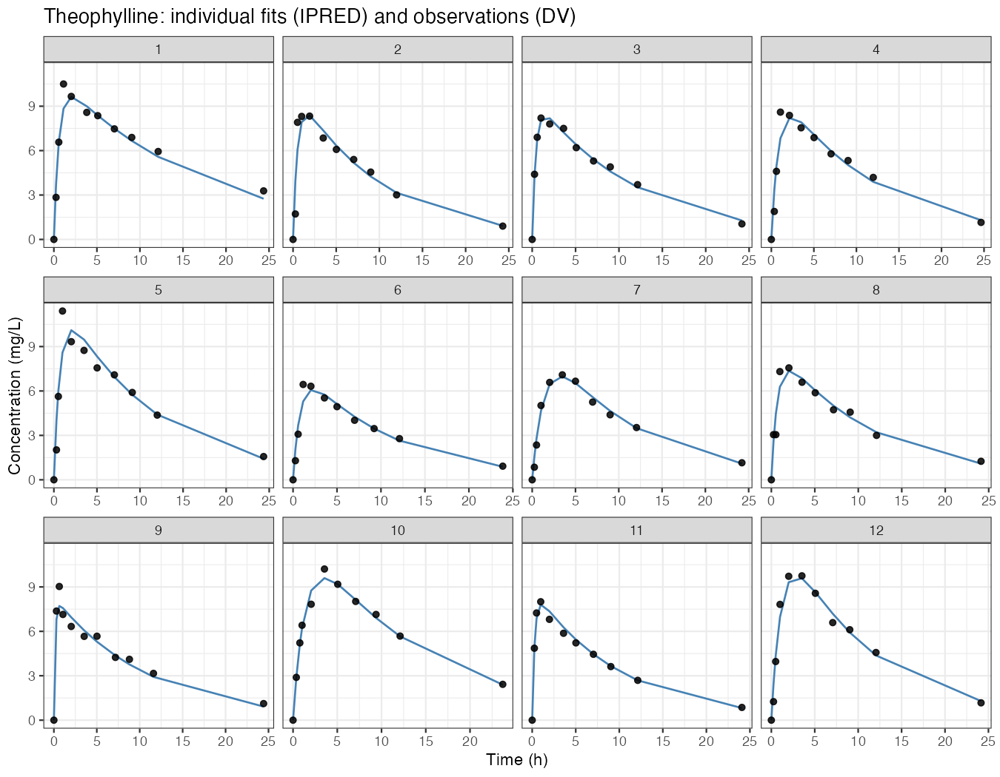
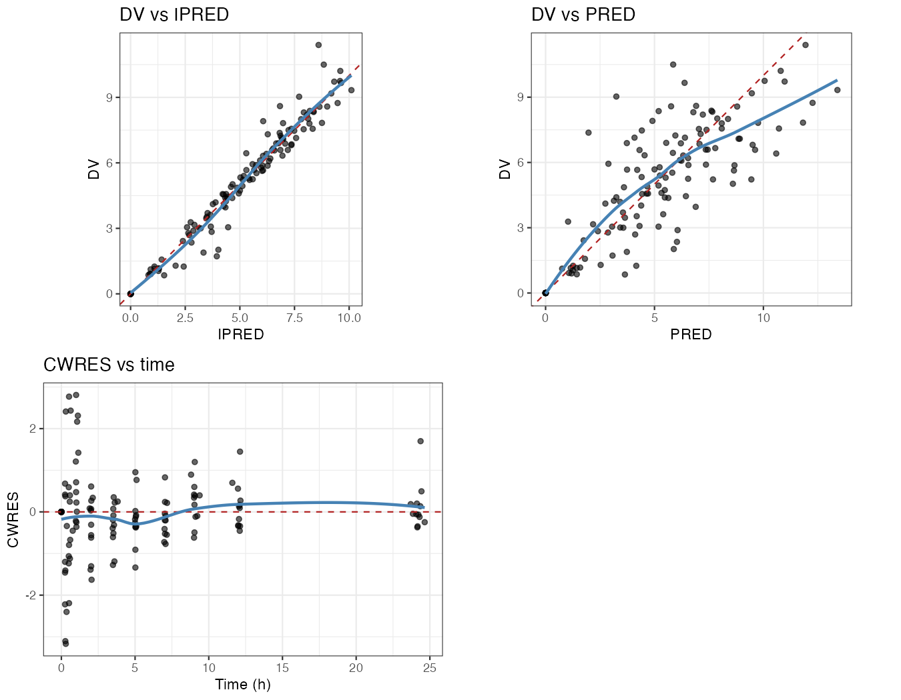

# Walkthrough — theophylline popPK with `easy-nonmem` and `monolix-cli`

A real, end-to-end session that exercises **both** skills in this repository on
the same dataset. Everything below was actually run on a macOS machine (Apple
Silicon, NONMEM 7.6 via PsN 5.7, MonolixSuite 2024R1 headless); the numbers and
files are the genuine outputs.

> **Goal.** Fit a one-compartment oral population PK model to the classic
> theophylline dataset (12 subjects, single oral dose 4.02 mg/kg), produce
> diagnostic plots, and then re-run the same data headlessly in Monolix to show
> the two tools agree.

| | NONMEM (easy-nonmem) | Monolix (monolix-cli) |
|---|---|---|
| Driver | PsN `execute` → `nmfe76` | `monolix.sh --no-gui` |
| Algorithm | FOCE-I | SAEM |
| Input | `run1.mod` + `theo_nm.csv` | `theophylline_project.mlxtran` |
| Time to converge | ~seconds | ~seconds (87 iterations, autostop) |

---

## The dataset

`examples/monolix-theophylline/theophylline_data.csv` (Monolix format):

```
ID,AMT,TIME,CONC,WEIGHT,SEX
1,4.02,0,.,79.6,M
1,.,0.25,2.84,79.6,M
1,.,0.57,6.57,79.6,M
...
```

12 subjects, 1 dose + 10 observations each. Dose is **mg/kg**, so estimated
`CL` and `V` are per-kg units (L/h/kg, L/kg).

---

## Part A — NONMEM with the `easy-nonmem` skill

### A1. Convert to NONMEM format

The skill's first step is data prep. `examples/nonmem-theophylline/prep_data.R`
maps Monolix columns to the NONMEM event-record layout (dose `CMT=1`, observation
`CMT=2`, `EVID`/`MDV` flags):

```r
d <- read.csv("../monolix-theophylline/theophylline_data.csv",
              stringsAsFactors = FALSE, na.strings = c("NA", "."))
```

> **Gotcha we hit.** `read.csv` does **not** treat `"."` as missing by default,
> so every row initially parsed as a dose (`132 doses, 0 observations`). Adding
> `na.strings = c("NA", ".")` fixes it — the rerun gives `12 doses, 120 observations`.

```bash
$ Rscript prep_data.R
wrote theo_nm.csv: 132 rows, 12 doses, 120 observations, 12 subjects
```

### A2. Author the control stream

Before writing options, the skill says to consult the bundled guides
(`references/guides/VI.md` → section *C.2 ADVAN2*, and `references/help/$input.ctl`).
That confirms: one-compartment first-order absorption = `ADVAN2 TRANS2`, default
observation compartment is the central (here `CMT=2`).

The resulting `examples/nonmem-theophylline/run1.mod`:

```text
$PROBLEM  Theophylline 1-cpt oral popPK (easy-nonmem walkthrough)
$INPUT  ID TIME AMT DV WT SEX EVID CMT MDV
$DATA   theo_nm.csv IGNORE=@

$SUBROUTINES ADVAN2 TRANS2

$PK
  TVKA = THETA(1)
  TVCL = THETA(2)
  TVV  = THETA(3)
  KA   = TVKA * EXP(ETA(1))
  CL   = TVCL * (WT/70)**0.75 * EXP(ETA(2))   ; allometric weight, 70 kg ref
  V    = TVV  * (WT/70)       * EXP(ETA(3))
  S2   = V
  K    = CL/V

$ERROR
  IPRED = F
  Y     = IPRED * (1 + EPS(1)) + EPS(2)       ; combined prop. + additive

$THETA
  (0, 1.0, 20)   ; KA  (1/h)
  (0, 0.04, 5)   ; CL  (L/h/kg)
  (0, 0.5, 5)    ; V   (L/kg)

$OMEGA  0.09 0.09 0.09          ; IIV on KA, CL, V
$SIGMA  0.05 0.01               ; proportional, additive

$ESTIMATION METHOD=1 INTERACTION MAXEVAL=9999 SIGDIG=3 POSTHOC
$COVARIANCE PRINT=E
$TABLE ID TIME DV WT SEX KA CL V PRED IPRED CWRES NOAPPEND NOPRINT ONEHEADER
       FILE=sdtab1
```

### A3. Run with PsN

```bash
$ cd examples/nonmem-theophylline
$ execute run1.mod -directory=theo_run -threads=4
...
0ITERATION NO.:   56    OBJECTIVE VALUE:   134.834527880128
 Elapsed estimation  time in seconds:     0.37
Done with nonmem execution
F:1 ..
execute done
```

`run1.lst` ends with `MINIMIZATION SUCCESSFUL` and the covariance step completed.

### A4. Results

From `run1.ext` (final row `-1000000000`):

| Parameter | Estimate | Interpretation |
|---|---|---|
| KA (THETA1) | **1.556** h⁻¹ | absorption rate |
| CL (THETA2) | **0.0406** L/h/kg | clearance |
| V (THETA3) | **0.469** L/kg | volume |
| IIV KA (√ω²) | 0.66 | ~66% |
| IIV CL (√ω²) | 0.31 | ~31% |
| IIV V (√ω²) | 0.23 | ~23% |
| OBJ (no const) | **134.83** | FOCE-I objective |

ETABAR ≈ (−0.013, 0.003, −0.008) — near zero, as expected for a well-specified model.

### A5. GOF plots (R + ggplot2)

`gof_plots.R` reads the `$TABLE` output. One more real-world snag: NONMEM writes
a `TABLE NO. 1` banner line before the header, so the table must be read with
`skip=1`, and dose rows (where `DV` is `.`) become `NA` and are dropped.





The individual fits track the observed points well; `DV` vs `IPRED`/`PRED` sit on
the identity line and `CWRES` scatter around zero.

---

## Part B — Monolix with the `monolix-cli` skill

Same data, headless, no GUI. The `monolix-cli` skill ships the Apple-Silicon
`x86shim` (forces `-arch x86_64` for the model plugin); on macOS you prepend it
to `PATH`:

```bash
$ cd examples/monolix-theophylline
$ SKILL_DIR=../../skills/monolix-cli
$ PATH="$SKILL_DIR/x86shim:$PATH" \
  /Applications/MonolixSuite2024R1.app/Contents/Resources/monolixSuite/bin/monolix.sh \
  --no-gui -p "$PWD/theophylline_project.mlxtran" \
  -o "$PWD/theophylline_walkthrough" --mode basic
...
DATASET INFORMATION
Number of individuals: 12
Number of observations (CONC): 120
Number of doses: 12
```

SAEM converged in **87 iterations (autostop)**. From
`theophylline_walkthrough/populationParameters.txt`:

| Parameter | Estimate | RSE% | 95% CI |
|---|---|---|---|
| ka_pop | **1.554** h⁻¹ | 20.6 | [1.05, 2.30] |
| Cl_pop | **0.0398** L/h/kg | 8.3 | [0.034, 0.047] |
| V_pop | **0.459** L/kg | 4.6 | [0.419, 0.503] |
| omega_ka | 0.656 | 22.4 | — |
| omega_Cl | 0.264 | 23.5 | — |
| omega_V | 0.132 | 29.4 | — |
| a, b (error) | 0.448, 0.052 | — | combined |

`summary.txt`: OFV (−2LL) = **341.49**, AIC = 357.49, BIC = 361.36.

---

## Cross-tool comparison

| Parameter | NONMEM (FOCE-I) | Monolix (SAEM) | Agreement |
|---|---|---|---|
| KA | 1.556 h⁻¹ | 1.554 h⁻¹ | <0.2% |
| CL | 0.0406 L/h/kg | 0.0398 L/h/kg | ~2% |
| V | 0.469 L/kg | 0.459 L/kg | ~2% |

The structural parameters agree to within ~2%, which is exactly the reproducibility
you want between two independent estimation engines. The IIV terms and residual
error differ a bit more — expected, since the NONMEM model here carries allometric
weight scaling while the Monolix base project (`theophylline_project.mlxtran`)
estimates without covariates, and FOCE-I vs SAEM handle random effects differently.
(OFV values are on different scales/constants and are **not** directly comparable.)

---

## What this demonstrated

- **`easy-nonmem`** — NM-TRAN authoring guided by bundled manuals, PsN `execute`,
  and R/ggplot2 diagnostics from `$TABLE` output, including two real pitfalls
  (`.` NA handling, `TABLE NO.` banner with `skip=1`).
- **`monolix-cli`** — a fully headless SAEM run via `monolix.sh --no-gui` with the
  x86 shim, producing the standard result folder (`populationParameters.txt`,
  `summary.txt`, `predictions.txt`, `FisherInformation/`, `Tests/`).
- Cross-engine consistency on the same dataset.

## Reproduce it

```bash
# NONMEM side (needs NONMEM 7.6 + PsN)
cd examples/nonmem-theophylline
Rscript prep_data.R
execute run1.mod -directory=theo_run -threads=4
Rscript gof_plots.R

# Monolix side (needs MonolixSuite 2024R1; see ../SETUP.md)
cd ../monolix-theophylline
PATH="$PWD/../../skills/monolix-cli/x86shim:$PATH" \
  /Applications/MonolixSuite2024R1.app/Contents/Resources/monolixSuite/bin/monolix.sh \
  --no-gui -p "$PWD/theophylline_project.mlxtran" \
  -o "$PWD/theophylline_walkthrough"
```

Files: `examples/nonmem-theophylline/` (data prep, control stream, results, plots)
and `examples/monolix-theophylline/theophylline_walkthrough/` (Monolix results).
